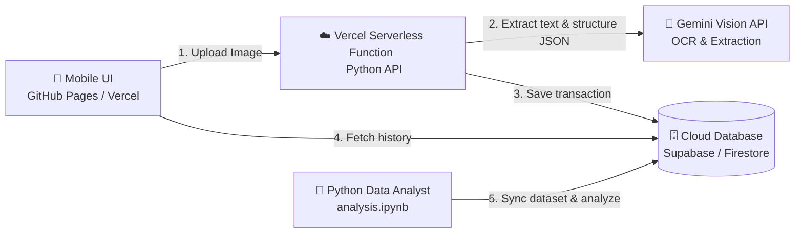

# Implementation Plan - Smart Receipt Scanner & Expense Logger

We will build a fully functional, mobile-accessible **Smart Receipt Scanner & Expense Logger** cloud application. Users can take pictures of receipts on their phones, upload them to a serverless backend hosted on Vercel, store the extracted data in a cloud database, and analyze the dataset using a Python script.

---

## 🛠️ Technology Stack & Architecture



1. **Frontend (GitHub Pages / Vercel)**:
   - Mobile-responsive Single Page Application (`index.html`) using premium, clean glassmorphic CSS.
   - Accesses phone camera or photo gallery for receipt uploads.
   - Fetches and displays a dashboard of parsed transactions (merchant, date, category, total expense).
2. **Backend (Vercel Serverless Function in Python)**:
   - Exposes a POST API endpoint (`/api/scan`).
   - Receives base64 image data and sends it to the free-tier **Gemini API** (`google-generativeai`) to extract receipt details as structured JSON (Merchant, Date, Items, Category, Total).
   - Falls back to a mock rule-based extractor if no API key is configured, ensuring the app runs immediately.
3. **Database (Supabase / Firestore)**:
   - Stores transactions (ID, merchant, date, category, total, image_url).
   - Allows direct secure fetching by the frontend and the Python analysis script.
4. **Python Data Analysis (`analysis.ipynb` / `analysis.py`)**:
   - Connects to the cloud database to download the transaction log.
   - Cleans the data, performs train/test splitting (80% / 20%).
   - Implements a text/numerical classifier (e.g., predicting transaction category based on merchant name and total amount using `scikit-learn` or standard statistics).
   - Evaluates classification accuracy, precision, and recall, and plots metrics (confusion matrix, expenditure trends).

---

## 🤖 Subagent Orchestration Plan

We will spawn four specialized subagents to implement these components in parallel:

1. **`frontend-agent`**: Creates the premium mobile-responsive `index.html` UI (camera capture, gallery upload, glassmorphic layout, transaction list).
2. **`backend-agent`**: Sets up the Vercel project configuration (`vercel.json`) and the Python serverless API function (`api/index.py`) using Gemini API.
3. **`analysis-agent`**: Writes `analysis.ipynb` (data ingestion, preprocessing, train/test splitting, ML model, confusion matrix plot) and a helper script to populate the database with mock records for instant testing.
4. **`report-agent`**: Writes the Indonesian academic project report (`laporan_proyek.md`) and a video script (`presentation_script.md`).

---

## 📂 Proposed File Structure

We will create all files inside [Cloud_Computing_TA](file:///c:/AntiGravity Stuff (No delete pls T-T)/Cloud_Computing_TA):

```
Cloud_Computing_TA/
├── vercel.json                 # Vercel configuration file
├── api/
│   └── index.py                # Serverless Python backend function
├── index.html                  # Mobile-responsive web interface
├── analysis.ipynb              # Python Jupyter Notebook for data analysis
├── seed_db.py                  # Script to pre-populate database with dummy data
├── laporan_proyek.md           # Indonesian academic report
└── presentation_script.md      # Video recording script / guide
```

---

## ⚠️ User Review Required

> [!IMPORTANT]
> **Cloud Database Choice**: We recommend **Supabase** (PostgreSQL) as it is free, highly standard, and easy to query from both JavaScript and Python.
> - We will write code to work with Supabase. You can create a free account at [supabase.com](https://supabase.com) and paste the URL and Key in a `.env` file, OR we can use a built-in lightweight local storage fallback so you can run the whole app instantly without setting up accounts.
> 
> **Gemini API Key**: The backend will use `google-generativeai` to scan receipts. We will make it look for a `GEMINI_API_KEY` environment variable. If you don't have one, it will generate realistic mock data so you can test the upload flow instantly.

---

## ✅ Verification Plan

### Automated/Local Verification
1. Run the Python backend locally (`python api/index.py` or via a lightweight Flask adapter) to test API endpoints.
2. Run `seed_db.py` to populate test transaction data.
3. Run `analysis.ipynb` and verify:
   - Successful database connection and data downloading.
   - Successful train/test partitioning.
   - Classification model training and evaluation metrics output.

### Manual Verification
- Deploy to Vercel/GitHub Pages and open the web app on your phone.
- Upload a receipt image, confirm it gets scanned, and verify the transaction list updates dynamically.
