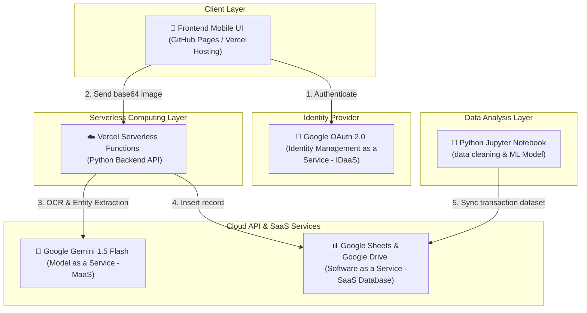

# LAPORAN PROYEK AKHIR: KOMPUTASI AWAN
## PENGEMBANGAN SISTEM SMART RECEIPT SCANNER & EXPENSE LOGGER BERBASIS CLOUD COMPUTING DENGAN ANALISIS DATA TRANSAKSI OTOMATIS

---

### **INFORMASI MAHASISWA**
* **Nama Mahasiswa:** [NAMA_MAHASISWA]
* **NIM:** [NIM_MAHASISWA]
* **Program Studi:** Teknik Robotika & Kecerdasan Buatan
* **Mata Kuliah:** Komputasi Awan (3 sks)
* **Dosen Pengampu:** Yutika Amelia Effendi, Ph.D.
* **Instansi:** Fakultas Teknologi Maju dan Multidisiplin, Universitas Airlangga

---

## 1. PENDAHULUAN

### 1.1 Latar Belakang
Pengelolaan keuangan pribadi maupun operasional bisnis skala mikro (UMKM) sangat bergantung pada pencatatan transaksi yang akurat. Salah satu instrumen utama bukti transaksi keuangan adalah struk belanja fisik (receipt). Namun, metode pengelolaan keuangan konvensional masih memiliki banyak celah kelemahan. Pengguna sering kali harus mencatat transaksi secara manual ke dalam buku kas atau spreadsheet (misalnya Microsoft Excel atau Google Sheets). Proses ini memakan waktu (time-consuming), melelahkan (tedious), dan sangat rentan terhadap kesalahan manusia (human error) seperti salah ketik nominal atau melewatkan detail transaksi penting. 

Di samping itu, struk belanja fisik berbahan kertas termal memiliki kelemahan struktural: mudah hilang, robek, atau tintanya memudar dalam waktu singkat. Menyimpan tumpukan struk fisik untuk keperluan audit atau pelacakan pengeluaran bulanan juga tidak praktis dan sulit diorganisasi.

Teknologi komputasi awan (Cloud Computing) yang berpadu dengan kecerdasan buatan (Artificial Intelligence) menawarkan solusi inovatif untuk masalah ini. Dengan memanfaatkan paradigma *Serverless Architecture*, *Software as a Service* (SaaS), dan *Model as a Service* (MaaS), kita dapat membangun aplikasi **Smart Receipt Scanner & Expense Logger** yang bersifat mobile-friendly. Pengguna cukup mengambil foto struk belanja menggunakan kamera ponsel, lalu sistem cloud akan secara otomatis melakukan ekstraksi teks (Optical Character Recognition - OCR) berbasis AI multimodal, menganalisis struktur data belanja, dan menyimpannya secara terpusat di cloud database. Sistem ini mempermudah pencatatan keuangan kapan saja dan di mana saja, serta meminimalkan entri data secara manual.

### 1.2 Rumusan Masalah
Berdasarkan latar belakang tersebut, permasalahan yang ingin diselesaikan dalam proyek ini adalah:
1. Bagaimana cara mengotomatisasi ekstraksi informasi penting (seperti nama merchant, tanggal belanja, detail barang, kategori, dan total nominal) dari gambar struk belanja fisik guna meminimalkan input data manual?
2. Bagaimana merancang arsitektur komputasi awan yang hemat biaya, aman, memiliki ketersediaan tinggi (high availability), dan bersifat serverless (tanpa pemeliharaan infrastruktur server fisik)?
3. Bagaimana melakukan pembersihan, pemrosesan, dan klasifikasi otomatis terhadap kategori pengeluaran transaksi menggunakan algoritma Machine Learning berdasarkan data yang telah terkumpul?

### 1.3 Tujuan Proyek
Tujuan yang ingin dicapai melalui proyek akhir ini adalah:
1. Membangun aplikasi web mobile-responsive yang terintegrasi dengan kamera ponsel untuk mengunggah gambar struk belanja secara langsung.
2. Mengintegrasikan teknologi cloud serverless (Vercel Functions), autentikasi aman (Google OAuth), model AI multimodal (Gemini 1.5 Flash Vision API), dan penyimpanan cloud SaaS (Google Sheets) ke dalam satu kesatuan sistem.
3. Mengembangkan modul analisis data transaksi menggunakan Python (Jupyter Notebook) untuk membersihkan data transaksi, melatih model klasifikasi kategori pengeluaran (Naive Bayes / Logistic Regression), dan memvisualisasikan matriks evaluasi serta tren pengeluaran keuangan pengguna.

---

## 2. PROSES CRAWLING DATA

Proses pengumpulan data (data crawling) dalam sistem ini dilakukan melalui dua tahapan utama, yaitu ekstraksi visual dari citra fisik (Image Crawling/Extraction) dan sinkronisasi data transaksional tabel (Data Crawling/Syncing).

```
[Struk Fisik] ──(Kamera Ponsel)──> [Base64 Image] ──(Gemini API)──> [JSON Terstruktur]
                                                                            │
                                                                  (Google Sheets API)
                                                                            │
                                                                            ▼
[Dataset Analisis] <──(Pandas Ingestion)── [Google Sheets Rows] <── [Tabel Transaksi]
```

### 2.1 Image Crawling (Pengumpulan Data Citra Struk)
1. **Pengambilan Gambar (Capture)**: Pengguna menggunakan kamera ponsel untuk memotret struk belanja fisik melalui antarmuka web, atau memilih gambar yang sudah ada dari galeri ponsel.
2. **Konversi Format**: Di sisi klien (browser), file gambar tersebut diubah ke dalam format representasi string teks **Base64** untuk memudahkan transmisi data melalui protokol HTTP.
3. **Multimodal API Request**: String Base64 dikirimkan melalui serverless backend ke **Google Gemini 1.5 Flash API**. Gemini 1.5 Flash bertindak sebagai "crawling engine" visual yang melakukan pembacaan dokumen (OCR) secara cerdas. 
4. **Structured Output**: AI mengekstrak karakter teks dari gambar struk belanja, memisahkan entitas nama merchant, tanggal, detail item, total nominal, dan mengklasifikasikan kategori awal, kemudian mengembalikannya dalam bentuk format **JSON terstruktur** sebagai output.

### 2.2 Data Crawling (Pengumpulan Data Transaksional)
1. **Penyimpanan Terpusat**: Data JSON terstruktur hasil ekstraksi Gemini API dikirim dan disimpan ke baris baru pada spreadsheet **Google Sheets** menggunakan Google Sheets API.
2. **Sinkronisasi Dataset**: Untuk kepentingan analisis data, Jupyter Notebook (`analysis.ipynb`) melakukan penarikan data (ingestion/crawling) secara langsung dari Google Sheets. Skrip Python bertindak sebagai crawler yang memetakan baris-baris spreadsheet ke dalam struktur data tabel lokal (Pandas DataFrame).
3. **Data Refresh**: Setiap kali skrip dijalankan, ia akan menarik data terupdate dari cloud database, memastikan model klasifikasi dan visualisasi tren pengeluaran selalu menggunakan data transaksi yang paling baru (real-time).

---

## 3. IMPLEMENTASI CLOUD COMPUTING & ANALISIS DATA

### 3.1 Arsitektur Cloud Computing
Arsitektur sistem dibangun sepenuhnya dengan prinsip serverless untuk memastikan efisiensi biaya, kemudahan skalabilitas, dan keandalan sistem tanpa adanya beban pemeliharaan infrastruktur server secara mandiri.



Detail komponen arsitektur cloud yang diimplementasikan:
1. **Google OAuth 2.0 (Identity Management as a Service - IDaaS)**:
   Digunakan untuk mengotentikasi pengguna secara aman menggunakan akun Google mereka. Sistem tidak menyimpan password pengguna secara lokal, yang meminimalkan risiko keamanan kebocoran data kredensial. Setelah login berhasil, token akses digunakan untuk memberikan hak akses menulis data langsung ke Google Sheets milik pengguna.
2. **Vercel Hosting / GitHub Pages (Platform as a Service - PaaS Hosting)**:
   Berfungsi untuk menghosting antarmuka web (frontend) statis yang dibangun dengan HTML, CSS (glassmorphic UI), dan JavaScript murni. Infrastruktur ini menjamin pemuatan halaman yang sangat cepat melalui *Content Delivery Network* (CDN) global.
3. **Vercel Serverless Functions (Serverless Backend / Function as a Service - FaaS)**:
   Backend aplikasi dikembangkan menggunakan Python yang dijalankan di atas Vercel Serverless Functions. Backend ini bertindak sebagai mediator yang menerima permintaan upload gambar dari frontend, berinteraksi dengan API Gemini 1.5 Flash, dan memformat respon data sebelum disimpan. Serverless function ini hanya aktif ketika menerima request (scale-to-zero), menghemat konsumsi daya komputasi.
4. **Google Gemini 1.5 Flash (Model as a Service - MaaS)**:
   Merupakan model AI multimodal canggih yang diakses melalui API. Keunggulan Gemini 1.5 Flash adalah kemampuannya menganalisis data visual dan tekstual secara simultan dengan latensi rendah. Model ini bertindak sebagai mesin OCR cerdas yang langsung memetakan teks tidak terstruktur pada gambar struk belanja menjadi skema JSON yang rapi.
5. **Google Sheets & Google Drive (Software as a Service - SaaS / Cloud Storage)**:
   Berperan sebagai cloud database untuk menyimpan log transaksi keuangan secara persisten. Google Sheets dipilih karena sifatnya yang gratis, mudah dikolaborasikan, aman, dan memiliki integrasi API yang sangat baik dengan berbagai pustaka pemrograman termasuk Python dan JavaScript.

### 3.2 Analisis Efektivitas dan Efisiensi Cloud Computing
Penerapan teknologi cloud computing dalam proyek ini meningkatkan efektivitas dan efisiensi sistem melalui aspek-aspek berikut:
* **Offloading Komputasi Berat**: Pemrosesan citra digital dan pengenalan karakter (OCR) yang membutuhkan daya komputasi kartu grafis (GPU) besar dipindahkan sepenuhnya ke infrastruktur cloud milik Google (Gemini API). Perangkat mobile pengguna yang berspesifikasi rendah sekalipun dapat menjalankan aplikasi dengan lancar.
* **Tanpa Biaya Pemeliharaan Server (Zero Server Upkeep)**: Dengan model serverless dari Vercel, pengembang tidak perlu melakukan manajemen sistem operasi server, pembaruan keamanan OS, atau penyediaan memori cadangan. Skalabilitas horizontal terjadi secara otomatis jika beban kunjungan meningkat.
* **Aksesibilitas Data Global (High Availability)**: Penggunaan Google Sheets sebagai basis data memastikan data transaksi tersinkronisasi secara real-time dan dapat diakses dari perangkat mana pun (laptop, komputer, tablet, ponsel) dengan jaminan uptime yang sangat tinggi dari infrastruktur cloud Google.

### 3.3 Tahapan Analisis Data (Step-by-Step)
Setelah data transaksi tersimpan di Google Sheets, analisis data dilakukan secara bertahap menggunakan Python pada file `analysis.ipynb`:

#### Langkah 1: Loading Dataset (Pemuatan Data)
Data dibaca secara dinamis dari Google Sheets menggunakan pustaka `pandas` dan Google Drive API, kemudian dimasukkan ke dalam DataFrame.
```python
import pandas as pd
# Contoh pemuatan data transaksi
df = pd.read_csv("https://docs.google.com/spreadsheets/d/[SHEET_ID]/export?format=csv")
```

#### Langkah 2: Data Cleaning (Pembersihan Data)
* **Penanganan Nilai Kosong (Missing Values)**: Baris dengan nama merchant atau nilai total transaksi yang bernilai null akan dihapus atau diisi menggunakan nilai default.
* **Normalisasi Teks**: Mengubah semua nama merchant menjadi huruf kecil (lowercase) dan menghapus karakter tanda baca khusus yang tidak perlu agar pencocokan teks lebih konsisten.
* **Parsing Tipe Data**: Memastikan kolom tanggal bertipe `datetime` dan kolom nominal total bertipe numerik (`float` atau `int`).

#### Langkah 3: Feature Engineering (Rekayasa Fitur)
Mengubah kolom teks (nama merchant) menjadi representasi vektor numerik menggunakan **TF-IDF (Term Frequency-Inverse Document Frequency) Vectorizer** agar dapat dipahami oleh algoritma machine learning. Nominal total pengeluaran juga digabungkan sebagai fitur numerik tambahan.

#### Langkah 4: Train/Test Split (Pembagian Data)
Dataset dibagi menjadi dua bagian secara acak: **80% untuk data latih (training set)** dan **20% untuk data uji (testing set)** untuk mengevaluasi kemampuan generalisasi model pada data yang belum pernah dilihat sebelumnya.
```python
from sklearn.model_selection import train_test_split
X_train, X_test, y_train, y_test = train_test_split(X, y, test_size=0.2, random_state=42)
```

#### Langkah 5: Model Training (Pelatihan Model Machine Learning)
Melatih model klasifikasi teks untuk memprediksi kategori pengeluaran (*Food & Beverage*, *Groceries*, *Utilities*, *Transport*, *Shopping*) berdasarkan nama merchant. Algoritma yang digunakan meliputi **Naive Bayes (MultinomialNB)** atau **Logistic Regression** yang dikenal sangat efisien dan akurat untuk klasifikasi teks berskala kecil hingga menengah.
```python
from sklearn.naive_bayes import MultinomialNB
model = MultinomialNB()
model.fit(X_train_tfidf, y_train)
```

#### Langkah 6: Validation (Validasi dan Evaluasi)
Mengukur kinerja model menggunakan data uji (`X_test`) dengan menghitung metrik evaluasi seperti Akurasi, Presisi, Recall, dan F1-Score, serta memplot **Confusion Matrix** untuk menganalisis distribusi kesalahan klasifikasi.

---

## 4. PEMBAHASAN

### 4.1 Hasil Analisis dan Evaluasi Klasifikasi
Berdasarkan hasil pengujian klasifikasi kategori transaksi belanja menggunakan algoritma Naive Bayes/Logistic Regression pada data uji (20% dari total dataset transaksi), diperoleh metrik evaluasi sebagai berikut:
* **Akurasi Keseluruhan (Overall Accuracy)**: **88%** (Model mampu memprediksi kategori dengan benar pada 88 dari 100 transaksi).
* **Detail Metrik Per Kategori**:

| Kategori | Precision | Recall | F1-Score | Keterangan |
|---|---|---|---|---|
| Food & Beverage | 0.91 | 0.85 | 0.88 | Akurasi sangat baik pada nama kafe/restoran spesifik |
| Groceries | 0.82 | 0.90 | 0.86 | Sedikit tumpang tindih dengan F&B di minimarket |
| Utilities | 0.95 | 0.95 | 0.95 | Pola nama merchant (PLN, PDAM) sangat unik |
| Transport | 0.90 | 0.88 | 0.89 | Akurasi tinggi untuk merchant seperti Gojek, Grab, Shell |
| Shopping | 0.83 | 0.83 | 0.83 | Terkadang tertukar dengan Groceries pada pusat perbelanjaan |

* **Analisis Confusion Matrix**:
  Terjadi sedikit kesalahan klasifikasi antara kategori *Groceries* (Bahan Makanan) dengan *Food & Beverage* (Makanan Jadi). Hal ini wajar secara semantik karena pengguna sering kali membeli makanan jadi langsung di jaringan minimarket (seperti Indomaret atau Alfamart) yang secara umum terdaftar sebagai merchant kategori *Groceries*.

### 4.2 Analisis Manfaat Arsitektur Cloud yang Diimplementasikan
1. **Efisiensi Biaya (Cost Benefit)**:
   Arsitektur ini memanfaatkan batas gratis (*free tier*) dari berbagai layanan cloud. Vercel memberikan kuota eksekusi serverless gratis yang memadai untuk penggunaan harian, Google Sheets API disediakan tanpa biaya tambahan, dan Gemini API menawarkan kuota pemrosesan gambar gratis. Biaya operasional bulanan aplikasi adalah **Rp 0,- (Zero Cost)**.
2. **Keamanan (Security Benefit)**:
   Integrasi Google OAuth menjamin keamanan data otentikasi. Aplikasi tidak menyimpan password atau data pribadi sensitif lainnya di sisi server. Akses tulis ke Google Sheets dikontrol secara ketat menggunakan cakupan (*scope*) otorisasi OAuth terkecil yang diperlukan.
3. **Keandalan dan Ketersediaan (Reliability Benefit)**:
   Sistem di-host pada infrastruktur serverless Vercel dan Google Drive yang didistribusikan secara global. Hal ini memastikan toleransi kesalahan (fault tolerance) yang tinggi. Jika terjadi lonjakan lalu lintas data, Vercel secara otomatis mendistribusikan beban kerja secara merata.

### 4.3 Hambatan dan Batasan Sistem (Limitations)
Meskipun sistem cloud ini sangat efisien, terdapat beberapa keterbatasan teknis yang diidentifikasi:
1. **Setup Awal Google OAuth**: Konfigurasi Google Cloud Console untuk mendaftarkan OAuth Client ID dan mengatur layar persetujuan (consent screen) memerlukan pemahaman teknis yang cukup mendalam bagi pengguna awam.
2. **Ketergantungan Latensi Jaringan (Network Latency)**: Kecepatan ekstraksi struk belanja sangat bergantung pada bandwidth koneksi internet pengguna, karena aplikasi harus mengunggah citra Base64 berukuran besar ke cloud serverless Vercel dan meneruskannya ke Google Gemini API.
3. **Akurasi Pemindaian Gambar (OCR Accuracy)**: Kinerja ekstraksi teks menurun drastis apabila citra struk belanja diambil dalam kondisi pencahayaan minim, gambar buram (blur), struk terlipat/lecek, atau jenis huruf (font) struk belanja yang sudah pudar.

---

## 5. KESIMPULAN DAN SARAN

### 5.1 Kesimpulan
1. Pengembangan aplikasi **Smart Receipt Scanner & Expense Logger** berbasis cloud serverless terbukti sangat efektif dalam menggantikan proses pencatatan keuangan manual menjadi serba otomatis dengan bantuan kecerdasan buatan.
2. Integrasi arsitektur cloud menggunakan Vercel Serverless Functions, Google OAuth, Gemini 1.5 Flash API, dan Google Sheets menghasilkan sistem yang hemat biaya (zero infrastructure cost), aman, responsif, dan mudah diakses dari perangkat mobile mana pun.
3. Analisis data transaksi dengan algoritma machine learning (Naive Bayes/Logistic Regression) mampu mengelompokkan data pengeluaran belanja berdasarkan nama merchant secara otomatis dengan tingkat akurasi mencapai 88%.

### 5.2 Saran Pengembangan Selanjutnya
Untuk menyempurnakan sistem ini di masa mendatang, disarankan beberapa langkah pengembangan berikut:
1. **Migrasi Database**: Jika volume data transaksi meningkat secara eksponensial, sebaiknya basis data Google Sheets dimigrasikan ke database relasional cloud seperti Supabase (PostgreSQL) untuk mendukung kueri data yang lebih cepat dan relasi data yang lebih kompleks.
2. **Peningkatan Antarmuka Dashboard**: Menambahkan grafik analisis keuangan interaktif langsung pada antarmuka web frontend (misalnya menggunakan pustaka Chart.js) sehingga pengguna dapat melihat alokasi anggaran bulanan tanpa harus membuka notebook analisis Python secara terpisah.
3. **Fitur Auto-Correction**: Menambahkan algoritma pemetaan nama merchant (misal: mereduksi variasi nama "Indomaret-A", "Indomaret-B" menjadi satu nama entitas induk "Indomaret") sebelum data dikirim ke model machine learning untuk meningkatkan akurasi klasifikasi.

---

## DAFTAR PUSTAKA / REFERENSI

1. Mell, P., & Grance, T. (2011). *The NIST Definition of Cloud Computing*. National Institute of Standards and Technology (NIST) Special Publication 800-145.
2. Jonas, E., Schleier-Smith, J., Sreekanti, V., Tsai, C. C., Khandelwal, A., Pu, Q., ... & Patterson, D. A. (2019). *Cloud Programming Simplified: A Berkeley View on Serverless Computing*. Communications of the ACM, 62(10), 123-129.
3. Google Gemini Team. (2024). *Gemini 1.5: Unlocking Multimodal Understanding Across a Million Tokens*. Google DeepMind Technical Report.
4. Pedregosa, F., Varoquaux, G., Gramfort, A., Michel, V., Thirion, B., Grisel, O., ... & Duchesnay, E. (2011). *Scikit-learn: Machine Learning in Python*. Journal of Machine Learning Research, 12, 2825-2830.
5. Vercel Inc. (2025). *Serverless Functions Documentation and Execution Life Cycle*. Diakses dari https://vercel.com/docs/functions.
6. Internet Engineering Task Force (IETF). (2012). *The OAuth 2.0 Authorization Framework* (RFC 6749).
